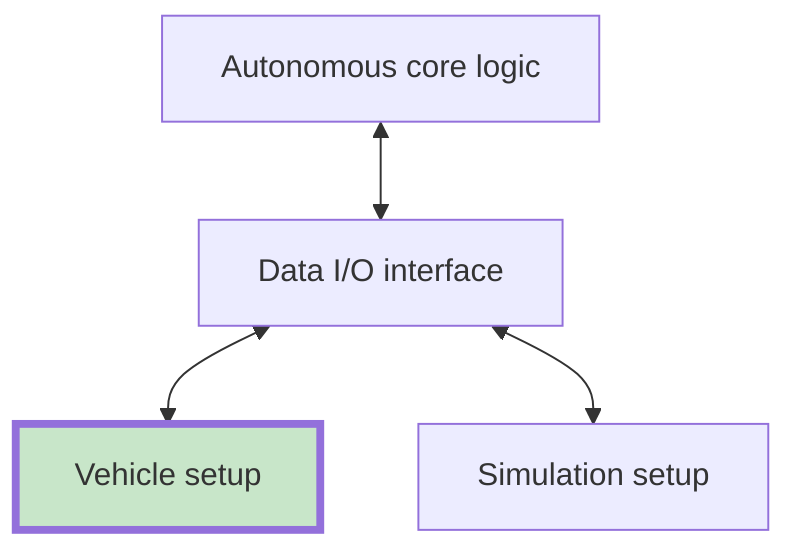

# Vehicle setup

This repository is the **real-car I/O layer** Autonomous Systems stack. It connects the prototype’s sensors and actuators to the autonomy software: data comes in from the vehicle, commands go out to the traction motor and steering motor.

## In the autonomy stack

The autonomy stack is split so the same core logic can run on the car or in simulation. A dedicated **data I/O interface** repository will hold the shared ROS 2 contract. This repository **implements that contract on the physical vehicle**. The simulation repository does the same against virtual sensors and actuators.

- **Autonomous core logic:** [autonomous-systems-core](https://github.com/TecnicoFuelCell/autonomous-systems-core)
- **Vehicle setup (this repo):** [autonomous-systems-vehicle](https://github.com/TecnicoFuelCell/autonomous-systems-vehicle)
- **Simulation setup:** [autonomous-systems-simulation](https://github.com/TecnicoFuelCell/autonomous-systems-simulation)
- **Data I/O interface:** planned repository for the shared ROS 2 topics and messages